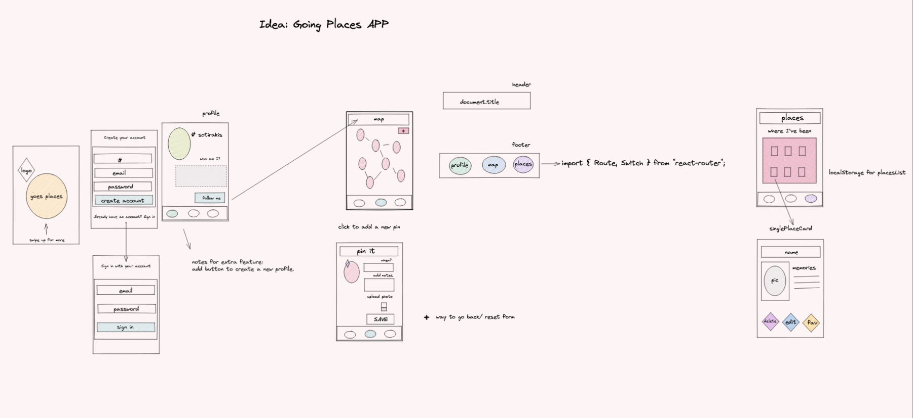

### **GOING PLACES APP**

## Welcome to my Capstone Project 👩🏼‍💻

Hello there, this is my Capstone Project for the neue fische Web Development Bootcamp. My app is called "Going Places" and is a travel social media app, where toys are taking vacations and seeing the world 🌎 and post their memories!

---

## How it started 📝

---

## What is Going Places 👀

Somewhere in 2017 I received this teddy bear as a gift! Since then it became an inseperable companion
throughout my trips. I blogged the photos and made my
friends smile and made me smile. After a while my friends
started asking if they could take “sotirakis” with them abroad, and they began sending me pictures. Seeing sotirakis being in famous landmarks while I was in Athens
was inspiring and fun.

---

## Problem 🤷‍♀️

“almost every person I spoke to knew someone who had taken a toy travelling.” and still no app to document all this.

---

## Solution ⚡️

You can _now_ save your pins and upload pictures instantly by using the map and you can display them and keep track of all the photos and places your toy has ever been too!

---

## Random notes 🌈

I've been given 4 weeks to apply all the stuff I have learnt during the previous 8 weeks of the Bootcamp. My App is definetely not perfect, but it's fun and after all it's my very first project to build from scratch,**SO** I love it for all the things that I learnt while building it!
